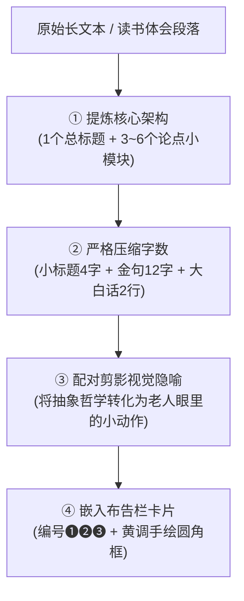

# 特雷勒式复古纸板剪影长海报技能 (continous-long-poster-fugu)

本技能将**长篇读书体会、文章摘要、方法论要点、生活观察**转化为**特雷勒式（Bill Traylor）复古纸板剪影风格的纵向连续长海报**。具备长文本排版精炼、抽象论点视觉化转化、Gemini 分段连续生图与自动化无缝羽化拼接全流程能力。

---

## 核心视觉骨架 (Core Aesthetic Blueprint)

> **视觉五支柱**：纸板底色、铅笔单线、剪影人物、低饱和原色、布告栏构图。

```
┌─────────────────────────────────────────────────────────────┐
│  1. 纸板底色：粗糙硬纸板、折痕纤维、磨损肌理、复古暖纸香     │
│  2. 铅笔单线：粗细均匀的素描勾边，不刻意精修，松弛儿童画质感 │
│  3. 剪影人物：戴礼帽/便帽、细长棍棒肢体、五官省略、动作夸张 │
│  4. 低饱和原色：深蓝、赭红、土黄、炭黑平涂，无复杂光影渐变   │
│  5. 布告栏构图：无透视平面平铺，像剪纸与手账般结构化网格卡片 │
└─────────────────────────────────────────────────────────────┘
```

---

## 读书体会与长文本精炼引擎 (Text Condensation Engine)

当输入为长篇段落或读书摘要时，严格按照以下四步规则进行信息重构与字数压缩：



### 字数与排版规范

| 元素 | 建议字数 | 规范与示例 |
| :--- | :--- | :--- |
| **总标题** | 6 ~ 12 字 | 《读书笔记｜系统思考的5个底层真相》 |
| **副标导语** | 14 ~ 20 字 | ★ 把复杂世界的运行规律，装进一张布告栏 ★ |
| **模块序号 + 小标** | 符号 + 3~5 字 | ❶ **存量拔河** ｜ ❷ **堵漏杠杆** ｜ ❸ **时滞陷阱** |
| **模块金句** | 10 ~ 14 字 | *堵住流失，比盲目加大输入更具百倍杠杆。* |
| **模块白话拆解** | 2 行（每行 8~12 字） | “水桶破洞越大，加水越徒劳。<br>改善保温才是高收益解法。” |
| **底部总金句** | 12 ~ 20 字 | ★ 用最少的线，记下最动人的认知片段。 ★ |

---

## 抽象概念 ➔ 剪影隐喻转化库 (Visual Metaphors)

- **对抗 / 拉扯** ➔ 两个黑帽小人各拉绳子一端，中间吊着水桶或茶壶。
- **高杠杆 / 治本** ➔ 小人弯腰用刷子修补木桶裂缝，另一人坐在长椅乘凉。
- **时间延迟 / 观望** ➔ 小人站在巨大沙漏前，指着钟楼，小狗趴在脚边。
- **过程损耗 / 动态失衡** ➔ 小人挑水赶路，水边走边洒，身后留下一串水滴。
- **外部剧变 / 稳态打破** ➔ 大风吹来，小人两手紧按礼帽前倾对抗，树木弯曲。
- **行动清单** ➔ 平铺 3 个手绘小物件（咖啡杯、笔记本、放大镜、长柄雨伞）。

---

## 连续长海报五步制作工作流 (Workflow)

### 第一步：文本精炼与分段切片规划
将输入的读书体会梳理为 3 段连续切片规划表：
- **Segment 01**：大标题 + 导语星号条 + 模块 ❶ 与 ❷ + 开放式纸板底色。
- **Segment 02**：承接纸板底色 + 模块 ❸ 与 ❹ + 开放式底部。
- **Segment 03**：承接纸板底色 + 模块 ❺ + 实操清单 + 底部深蓝通栏金句横幅。

### 第二步：Gemini 逐段连续生图
使用 `generate_image` 工具（比例 `9:16`）：

1. **生成 Segment 01**：
   - 提示词包含：纸板底色、总标题、模块 01-02 剪影插图、底部开放延伸。
2. **生成 Segment 02..N**：
   - 在 `ImagePaths` 中传入上一段切片文件绝对路径。
   - 提示词显式要求：`DIRECT VISUAL CONTINUATION of the reference image. Match exact cardboard tone (#C8A97A), pencil lines, and muted poster paint palette.`

### 第三步：自动化无缝羽化拼接
分段生成完毕后，调用内建脚本自动去除接缝：

```powershell
python ".agents/skills/continous-long-poster-fugu/scripts/stitch_poster.py" `
  output/segment_01.png `
  output/segment_02.png `
  output/segment_03.png `
  -o "output/fugu_long_poster.png" `
  --overlap-ratio 0.08
```

---

## 核心提示词模版 (Prompt Formula)

可以直接复制的通用生图模版：

```text
用纸板剪影叙事风绘制 {主题}，粗糙纸板作为背景，铅笔单线勾勒，海报颜料平涂，人物为棍棒四肢剪影，五官极简或省略，用夸张姿态传达情绪。画面无透视，像布告栏一样平面排列，使用深蓝、赭红、土黄、黑色等低饱和原色，整体像街边老人旁观日常小闹剧，温和幽默、荒诞可爱。禁止写实人体、高饱和荧光色、复杂光影、精致商业插画感。
```

---

## 负向约束护栏 (Strict Negative Constraints)

- 🚫 **绝对禁止写实人体**：五官不可精细描绘，肢体不可有解剖学写实肌肉。
- 🚫 **绝对禁止现代科技光效**：无 Neon、无发光描边、无现代科技流光。
- 🚫 **绝对禁止高饱和三原色**：必须是做旧沉淀的矿物颜料感（深蓝/赭红/土黄）。
- 🚫 **绝对禁止三维透视场景**：必须保持剪纸贴画式的纯平面平铺。

---

## 资源索引

- 视觉风格完整规范：[references/visual-spec.md](file:///D:/zed%20horse/.agents/skills/continous-long-poster-fugu/references/visual-spec.md)
- 读书笔记文本精炼指南：[references/text-condensation-guide.md](file:///D:/zed%20horse/.agents/skills/continous-long-poster-fugu/references/text-condensation-guide.md)
- Gemini 提示词中英文公式库：[references/prompt-engineering.md](file:///D:/zed%20horse/.agents/skills/continous-long-poster-fugu/references/prompt-engineering.md)
- 自动无缝拼接脚本：[scripts/stitch_poster.py](file:///D:/zed%20horse/.agents/skills/continous-long-poster-fugu/scripts/stitch_poster.py)
