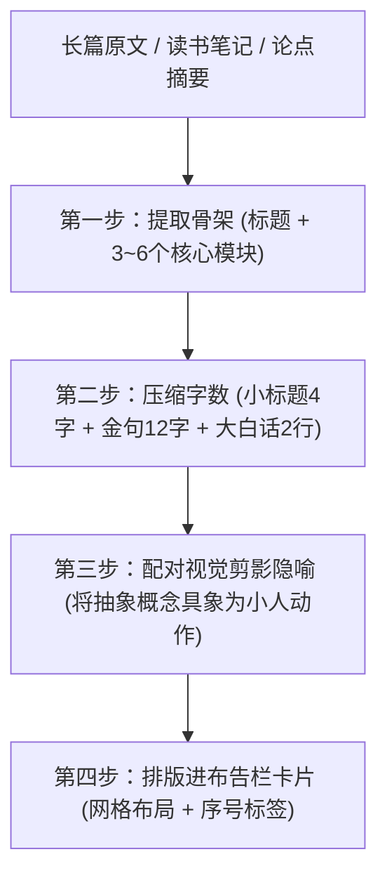

# 读书体会与长文本排版精炼指南 (Text Condensation & Logic Guide)

长海报不是把整篇长文章原样贴上去，而是将**长文本、读书笔记、多段论点**转化为**高信息密度、极低阅读阻力、结构化、图文对齐的布告栏海报卡片**。

---

## 文本精炼四步法则 (4-Step Transformation Pipeline)



---

## 1. 字数与层级硬规范 (Strict Typography Hierarchy)

每张切片内，文案必须严格控制在以下字数区间，确保在手机端阅读时一目了然：

| 层级 | 位置 | 建议字数 | 示范格式 |
| :--- | :--- | :--- | :--- |
| **主标题** | 顶部最显眼处 | **6 ~ 12 字** | 《读书笔记⑤｜系统思考的5个底层真相》 |
| **副标导语** | 主标正下方（星号框） | **14 ~ 20 字** | ★ 把复杂世界的运行规律，装进一张布告栏 ★ |
| **模块序号** | 卡片左上角 | **数字符号** | ❶ ❷ ❸ ❹ ❺ ❻ |
| **模块小标题** | 序号旁边 | **3 ~ 6 字** | **存量拔河** / **堵漏杠杆** / **时滞陷阱** |
| **要点金句** | 卡片第一行（加粗/深蓝） | **10 ~ 14 字** | *堵住流失，比盲目加大输入更具杠杆。* |
| **白话拆解** | 卡片正文（2行） | **每行 8 ~ 12 字** | “水桶破洞越大，加水越徒劳。<br>改善保温才是高收益解法。” |
| **底部总金句** | 全图最底部深蓝横幅 | **12 ~ 20 字** | ★ 用最少的线条，看透最复杂的系统规律。 ★ |

---

## 2. 抽象论点 ➔ 剪影视觉隐喻映射表 (Visual Metaphor Mapping)

读书体会往往偏抽象，特雷勒风格的核心魅力在于**将抽象哲学转化为老人眼中的日常小动作/小闹剧**：

| 抽象读书论点 | 特雷勒式剪影画面隐喻 (Visual Metaphor) | 画面元素组合 |
| :--- | :--- | :--- |
| **认知冲突 / 力量拉扯** | 两个黑帽小人各拉绳子一端，中间吊着一个水壶 | 绳子、木桩、飞鸟掠过 |
| **高杠杆解 / 治本策略** | 一个小人正弯腰修补木桶底部的裂缝，另一个人坐在高处乘凉 | 木桶、小修补刷、长椅 |
| **时间延迟 / 反馈时滞** | 戴礼帽小人站在巨大沙漏前，指着远方钟楼上的指针 | 沙漏、钟楼、小黑狗蹲在旁边等候 |
| **动态损耗 / 过程失准** | 小人挑着两桶水赶路，水边走边洒，身后留下一串水滴 | 扁担、洒水桶、小鸭子跟在后面 |
| **临界阈值 / 外部冲击** | 一阵大风吹来，小人两手紧紧按住礼帽，身体前倾对抗 | 弯曲的树木、被吹飞的树叶、小黑狗逆风奔跑 |
| **长期复利 / 持续积累** | 小人一级一级攀爬木梯，上方树枝上停着一只大白鹭 | 梯子、苹果树、篮子 |
| **独立思考 / 避开盲从** | 一群小人朝右侧匆匆赶路，唯独一个黑帽小人朝左悠闲散步 | 街道路灯、反向行走的背影、小猫 |

---

## 3. 实战范例对比：长段落 ➔ 海报卡片精炼

### 原始长文本（读书笔记输入）：
> *“在动态复杂系统中，决策制定和实际产生效果之间总存在漫长且不可避免的时间滞后。很多人假设市场或组织能够像开关一样即时做出自平衡响应，这在现实中是根本不可能的，盲目加码干预只会导致系统剧烈震荡。”*

### 精炼后的海报卡片文案：
```
【卡片 ❸】
🏷️ 标题：时滞陷阱
💡 金句：物理世界的调节，从无即时响应
📝 拆解：
  • 决策发出到生效，必有时间延迟
  • 盲目密集干预，反而引发系统震荡
🎨 配图剪影：小人手持沙漏静静等待，身旁的时钟指针慢慢走动，脚边小狗悠闲打盹。
```

---

## 4. 长图切片规划模版（3 段式标准排版）

- **Segment 01（开场 + 模块 01-02）**：
  - 顶栏：大标题 + 导语星号条 + 右上角 `01/03` 标牌
  - 上半区：模块 ❶（要点 1 + 剪影插图）
  - 下半区：模块 ❷（要点 2 + 剪影插图）
  - 底部：开放式纸板底色，虚线向下延伸
- **Segment 02（中段 + 模块 03-04）**：
  - 顶部：承接虚线与纸板纹理，无重复大标题
  - 上半区：模块 ❸（要点 3 + 剪影插图）
  - 下半区：模块 ❹（要点 4 + 剪影插图）
  - 底部：开放式纸板底色，继续向下延伸
- **Segment 03（末段 + 模块 05 + 实操清单 + 底部金句横栏）**：
  - 上半区：模块 ❺（要点 5 + 剪影插图）
  - 中间区：【实操清单 / 避坑指南】3个手绘小物件图标
  - 底栏：深蓝通栏横幅 ★ 最终金句 ★ + 品牌/作者签名落款
