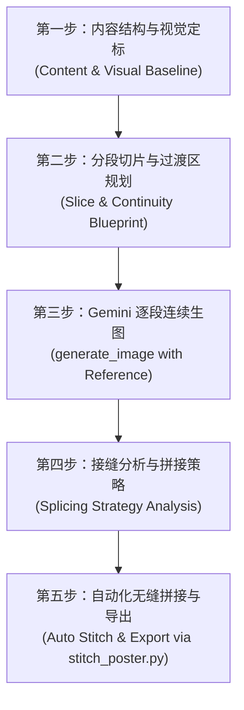

# 连续长海报生成与无缝拼接技能 (Continuous Long Poster)

使用本技能将长文本、文章、个人经历、知识干货、产品全景或故事流程转化为**高清晰度、无缝衔接的纵向连续长海报**。图像生成基于 **Gemini (`generate_image`)**，拼接融合由内建 Python 工具 `scripts/stitch_poster.py` 自动化执行。

---

## 核心设计原理 (Core Philosophy)

> **长海报不是把几张独立海报硬拼在一起，而是将整张海报视为一块完整的纵向连续画布，切分为多张 9:16（或指定比例）的连续切片生成，最终无缝拼接为一张浑然一体的长图。**

```
┌──────────────────────────────────────────────────┐
│  Segment 01: Top & Opening                       │
│  • 总大标题 + 核心开场 + 视觉入口                │
│  • 底部开放式延伸，预留 10-15% 过渡安全区        │
├──────────────────────────────────────────────────┤ ◄─── 渐变羽化融合带 (Overlap & Feather Blend)
│  Segment 02..N-1: Continuous Middle Slices       │
│  • 顶部直接承接上一段背景/光影/中轴线            │
│  • 中间承载当前章节核心图文                      │
│  • 底部继续向下开放延伸                          │
├──────────────────────────────────────────────────┤ ◄─── 渐变羽化融合带 (Overlap & Feather Blend)
│  Segment N: Final & Conclusion                   │
│  • 顶部承接上一段                                │
│  • 核心结论 + CTA 行动倡议 + 品牌底部收束        │
└──────────────────────────────────────────────────┘
```

---

## 标准五步工作流 (5-Step Workflow)



---

## 第一步：内容结构与视觉定标 (Content & Visual Baseline)

1. **输入解析**：读取用户提供的原始文本、知识笔记、经历或产品信息。
2. **段落划分**：根据信息量将长海报规划为 $N$ 个切片（建议 3-6 段，信息最饱满且视觉节奏最佳）。
3. **视觉风格定标（Visual Baseline Lock）**：
   - 确定**视觉风格**（参考 [references/visual-identities.md](file:///D:/zed%20horse/.agents/skills/continuous-long-poster/references/visual-identities.md)），如科技蓝图、商业画卷、知识图解、复古 Zine 等。
   - 确定**贯穿全图的核心视觉线索（Continuous Visual Thread）**：例如中央发光光缆、纵向时间轨迹、蜿蜒河流或渐变几何轴线。
   - 锁定**色彩体系**：主背景色（如 `#070B19` 深空蓝）、主文字色（`#FFFFFF`）、强调光效色（如 `#00E5FF` 电光青）。

---

## 第二步：分段切片与过渡区规划 (Slice Blueprint)

为每个分段输出明确的切片规格表：

| 分段序号 | 定位 | 顶部状态 | 核心内容 | 底部状态 | 视觉线索 |
| :--- | :--- | :--- | :--- | :--- | :--- |
| **Segment 01** | 开场与主标题 | 顶部主标题与视觉入口 | 总标题、核心痛点/背景 | 开放式延伸（无文字） | 视觉主轴自上向下引出 |
| **Segment 02..N-1** | 章节推进 | 严格承接上一段中轴与底色 | 章节序号（01/02）、核心卡片、图表 | 开放式延伸（无文字） | 视觉主轴穿越中轴连贯流动 |
| **Segment N** | 结论与收尾 | 承接前一段 | 总结复盘、金句、行动倡议 | 完整收束底边、品牌签名 | 视觉主轴汇聚于底部徽标 |

### 铁律护栏 (Hard Rules)
- **禁止每段独立**：中间各段**严禁**重复总标题、严禁出现“第N页/下一页/1/3”等翻页标记、严禁添加独立卡片封底。
- **安全过渡区**：每张分段图的顶部 10-15% 和底部 10-15% 严禁出现标题、正文、人物面部、卡片边框或 QR 码。

---

## 第三步：Gemini 逐段连续生图 (Gemini Image Generation)

使用 `generate_image` 工具逐段生成（参考 [references/prompt-templates.md](file:///D:/zed%20horse/.agents/skills/continuous-long-poster/references/prompt-templates.md)）：

### 1. 生成 Segment 01 (首段)
- 设定 `AspectRatio: "9:16"`，`ImageName: "segment_01"`。
- Prompt 包含：总标题、开场内容、整体视觉基准、开放式底部延伸指令。

### 2. 连续生成 Segment 02..N (后续各段)
- **多模态参考绑定**：调用 `generate_image` 时，在 `ImagePaths` 中传入上一段切片文件路径 `[ "path/to/segment_01.png" ]`。
- Prompt 明确声明：
  - `"DIRECT VISUAL CONTINUATION of the provided reference image."`
  - `"Inherit exact background gradient, chromatic values, and grid textures from the reference."`
  - `"Seamlessly continue the central glowing visual thread without interruption."`
  - `"Do NOT repeat master title. Keep top 10% and bottom 10% clean of text for seamless splicing."`

---

## 第四步：接缝分析与拼接策略 (Splicing Strategy Analysis)

分段图片生成后，逐对检查相邻分段 $(S_i, S_{i+1})$：

1. **接缝质量检查**：
   - 上一段底部与下一段顶部的背景色差是否 $\le 5\%$。
   - 中央视觉线索（如光缆/中轴）的水平坐标是否对齐（X=50%）。
2. **拼接策略选择**：
   - **羽化融合（Feather Blend - 推荐默认）**：重叠 6%~10% 高度，通过线性 Alpha 渐变抹平接缝。
   - **裁切后重叠（Crop & Overlap）**：若边缘有轻微冗余留白，先裁切 20~40px 再羽化。
   - **直接首尾拼接（Direct Stitch）**：仅用于背景高度一致且过渡线完美对齐的纯色底图。

---

## 第五步：自动化无缝拼接与导出 (Automated Stitching)

使用内建拼接脚本执行拼接：

```powershell
python ".agents/skills/continuous-long-poster/scripts/stitch_poster.py" `
  path/to/segment_01.png `
  path/to/segment_02.png `
  path/to/segment_03.png `
  path/to/segment_04.png `
  -o "output/final_long_poster.png" `
  --overlap-ratio 0.08 `
  --crop-top 0 `
  --crop-bottom 0
```

### 拼接脚本参数说明

| 参数 | 默认值 | 说明 |
| :--- | :--- | :--- |
| `images` | (必需) | 按从上到下顺序排列的分段图片路径列表 |
| `-o, --output` | (必需) | 最终导出长海报路径（支持 `.png` / `.jpg`） |
| `--overlap-ratio` | `0.08` (8%) | 相邻切片的重叠高度比例（执行线性渐变羽化） |
| `--overlap-px` | `None` | 固定重叠像素高度（指定时覆盖比例） |
| `--crop-top` | `0` | 中间/底部切片顶部裁切像素 |
| `--crop-bottom` | `0` | 顶部/中间切片底部裁切像素 |
| `--target-width` | `None` | 强制统一的像素宽度（默认自动以最大宽度对齐） |

---

## 质量验收检查清单 (Checklist)

- [ ] **完整长图感**：整张图自上而下视线流畅，无明显水平硬接缝。
- [ ] **视觉一致性**：各分段背景色温、字体层级、卡片风格、图标语言完全统一。
- [ ] **无分页痕迹**：无多余的页码、翻页提示、重复主标题或独立外边框。
- [ ] **文字清晰准确**：所有核心文案清晰可读，无乱码、错别字或被裁切现象。
- [ ] **贯穿线索连贯**：中央中轴/光流/道路自首段直通末段，无错位或突变。

---

## 资源索引

- 视觉风格体系：[references/visual-identities.md](file:///D:/zed%20horse/.agents/skills/continuous-long-poster/references/visual-identities.md)
- Gemini 提示词模版库：[references/prompt-templates.md](file:///D:/zed%20horse/.agents/skills/continuous-long-poster/references/prompt-templates.md)
- 飞书原文档知识归档：[references/feishu-source.md](file:///D:/zed%20horse/.agents/skills/continuous-long-poster/references/feishu-source.md)
- Python 自动无缝拼接脚本：[scripts/stitch_poster.py](file:///D:/zed%20horse/.agents/skills/continuous-long-poster/scripts/stitch_poster.py)
